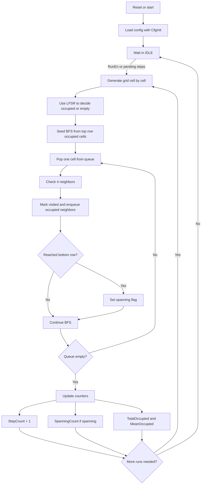

# Percolation Core - Schema Concettuale

Questo file spiega, in modo semplice, cosa fa il core di percolazione in [percolation_core.vhd](percolation_core.vhd).

## Idea generale

Il core esegue molte volte la stessa prova:

1. costruisce una griglia quadrata di celle
2. decide in modo pseudo-casuale quali celle sono occupate
3. controlla se esiste un percorso connesso dall'alto al basso
4. aggiorna alcune statistiche
5. ripete per il numero di run richiesto

In pratica risponde a questa domanda:

"Con una certa probabilità di occupazione `p`, quante volte una griglia casuale percola?"

## Interfaccia in parole povere

- `Rst` azzera tutto
- `CfgInit` carica i parametri e resetta lo stato interno
- `RunEn` dice al core di partire
- `StepAddValid` e `StepAddCount` aggiungono run in coda
- `CfgP` imposta la probabilità di occupazione
- `CfgGridSize` imposta la dimensione della griglia
- `CfgSeed` imposta il seed dell'LFSR
- `CfgRuns` imposta quanti run fare al massimo

Le uscite sono solo statistiche:

- `StepCount` = quanti run sono stati completati
- `PendingSteps` = quanti run restano in coda
- `SpanningCount` = quanti run hanno avuto percolazione
- `TotalOccupied` = somma delle celle occupate su tutti i run
- `MeanOccupied` = media delle celle occupate per run

## Cosa fa davvero il codice

Il core non fa una simulazione continua nel tempo.
Fa sempre questo ciclo:

- prepara una griglia casuale
- cerca un cluster connesso partendo dal bordo alto
- se il cluster arriva al bordo basso, conta un evento di spanning
- aggiorna i contatori
- decide se rifare tutto da capo

## Pseudocodice

```text
on reset:
    azzera stati e contatori

on CfgInit:
    carica grid size, p, seed e numero massimo di run
    azzera le statistiche

if RunEn = 1 or ci sono step in coda:
    se non ho già finito tutti i run richiesti:
        while non ho riempito tutta la griglia:
            per ogni cella:
                usa l'LFSR per decidere se è occupata
                conta le celle occupate

        prendi tutte le celle occupate della prima riga
        mettile in una coda BFS

        while la coda non è vuota:
            estrai una cella
            controlla i 4 vicini
            se un vicino è occupato e non visitato:
                marcialo come visitato
                mettilo in coda
            se arrivo all'ultima riga:
                segna spanning = vero

        incrementa StepCount
        se spanning = vero:
            incrementa SpanningCount
        aggiorna TotalOccupied e MeanOccupied

        se servono altri run:
            riparti con una nuova griglia
        altrimenti:
            torna in IDLE
```

## Flowchart



## Esempio mentale

Immagina una griglia piccola, per esempio 4x4.

- alcune celle sono accese
- il core parte dalle celle accese della riga superiore
- esplora tutte quelle collegate
- se trova una cella della riga inferiore, vuol dire che c'è un cammino completo dall'alto al basso

Quindi il core non cerca "la strada migliore": cerca solo se **esiste almeno un collegamento continuo**.

## Cosa significa per il benchmark

Questo core è interessante perché separa bene due tempi diversi:

- tempo UART: mandare i parametri dentro e riportare fuori le statistiche
- tempo del core: generare la griglia, fare la BFS e aggiornare i contatori

Per il benchmark conviene tenere fisso il messaggio UART e sottrarre il suo costo, così misuri meglio il lavoro vero del core.

## Nota importante

Il codice attuale usa una **BFS flood fill**, non un Hoshen-Kopelman classico. La logica è più semplice da capire, ma il principio fisico resta lo stesso: verificare se esiste un cluster che attraversa la griglia.
