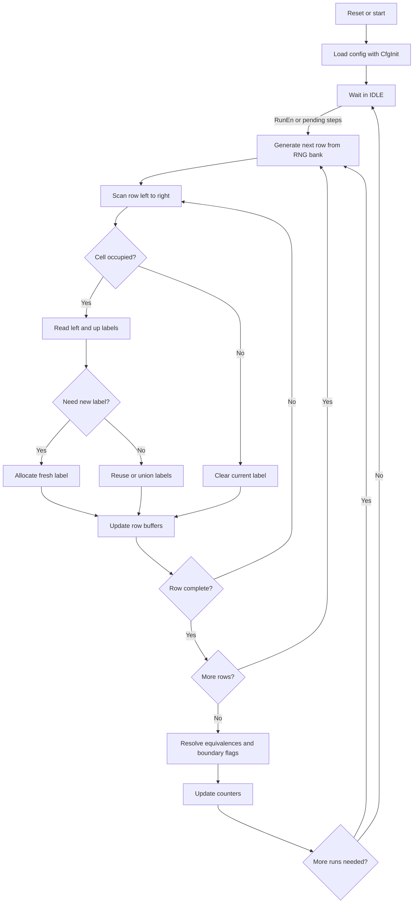

# Percolation Core - Schema Concettuale

Questo file spiega, in modo semplice, cosa fa il core di percolazione in [percolation_core.vhd](percolation_core.vhd) e fa da overview comune per i due backend di connettivita`, entrambi pensati in forma row-wise.

## Idea generale

Il core esegue molte volte la stessa prova:

1. costruisce una striscia di celle a larghezza fissa `N_ROWS_G`
2. decide in modo pseudo-casuale quali celle sono occupate tramite un bank RNG separato a larghezza compile-time `N_ROWS_G` (nel build di debug corrente `N_ROWS_G = 64`)
3. controlla se esiste un cluster che attraversa la striscia dall'alto al basso
4. aggiorna alcune statistiche
5. ripete per il numero di run richiesto

In pratica risponde a questa domanda:

"Con una certa probabilità di occupazione `p`, quante volte una griglia casuale percola?"

## Interfaccia in parole povere

- `Rst` azzera tutto
- `CfgInit` carica i parametri e resetta lo stato interno
- `RunEn` dice al core di partire
- `StepAddValid` e `StepAddCount` aggiungono run in coda
- `CfgP` imposta la probabilità di occupazione
- `CfgStepsPerRun` imposta quante righe processare per run; la sua larghezza si controlla dal top con `CFG_STEPS_BITS_G` (default 32)
- `CfgSeed` imposta il seed del bank RNG
- `CfgRuns` imposta quanti run fare al massimo
- la larghezza della riga resta fissata a compile-time dal generic `N_ROWS_G` del top

Le uscite sono solo statistiche:

- `StepCount` = quanti run sono stati completati
- `PendingSteps` = quanti run restano in coda
- `SpanningCount` = quanti run hanno avuto percolazione
- `TotalOccupied` = somma delle celle occupate su tutti i run

Se serve la media delle celle occupate per run, conviene calcolarla lato host come `TotalOccupied / StepCount`.

## Contratto tra RNG e connettività

La generazione casuale e la connettività devono restare separabili. Il contratto minimo tra i blocchi e` questo:

- `rng_hybrid_64`
    - `rst`: re-inizializza il bank RNG e riparte dal seed configurato
    - `master_key` / `run_tag`: diversificazione iniziale della sequenza
    - `threshold`: soglia di occupazione `p`
    - `site_open(N_ROWS_G-1 downto 0)`: bit di occupazione per la riga corrente
    - `busy`: vale `1` mentre il bank si inizializza
- blocco di connettivita` / frontier row-wise
    - consuma una riga alla volta dal RNG `N_ROWS_G`-wide
    - mantiene solo riga corrente e riga precedente
    - propaga la raggiungibilita` con due scan orizzontali e un seed verticale dalla riga precedente
- blocco di connettivita` / HK row-wise
    - consuma una riga di occupazione gia` confrontata con `p`
    - non conosce taps, seed o dettagli del RNG
    - usa etichette di riga, tabella union-find e flag di bordo per decidere lo spanning

Questo contratto permette di sostituire il PRNG con un bank RNG diverso senza toccare la logica di spanning e senza cambiare il controllo del core.

## Top applicativo sottile

Il passo successivo e` un wrapper di integrazione che parla con UART e non contiene logica algoritmica. Il suo compito e`:

- ricevere configurazione, seed e comandi start/stop/step
- trasferire i parametri al core
- leggere le statistiche a fine run o su richiesta
- esporre una superficie stabile per Python e benchmark

Questo top non deve duplicare il lavoro del core: non costruisce la griglia, non fa connettivita` globale e non genera numeri casuali.

La larghezza della riga e` fissata a compile-time dal generic `N_ROWS_G` del top applicativo. Il parametro runtime resta solo `CfgStepsPerRun`, che dice quante righe totali processare nel run corrente. La sua larghezza di rappresentazione la scegli dal top con `CFG_STEPS_BITS_G`.

In altre parole, il backend attuale usa una griglia rettangolare `N_ROWS_G x CfgStepsPerRun`. Se vuoi un caso quadrato per confrontarlo con il modello 2D standard, imposta `CfgStepsPerRun = N_ROWS_G`.

### Frame binari del wrapper

Il top applicativo usa messaggi binari a lunghezza fissa:

- request: 16 byte totali, organizzati in 4 word da 32 bit
    - word 0: `CfgP`
    - word 1: `CfgSeed`
    - word 2: `CfgStepsPerRun` nei 16 bit meno significativi
    - word 3: `CfgRuns`
- response: 16 byte totali, organizzati in 4 word da 32 bit
    - word 0: `StepCount`
    - word 1: `PendingSteps`
    - word 2: `SpanningCount`
    - word 3: `TotalOccupied`

Questo layout mantiene il wrapper molto semplice e permette di fare un controllo Python diretto senza parsing testuale.

## Cosa fa davvero il codice

Il core non fa una simulazione continua nel tempo.
Fa sempre questo ciclo:

- prepara una striscia casuale alta `CfgStepsPerRun` righe
- prende una riga alla volta dal bank RNG `N_ROWS_G`-wide
- aggiorna la frontier di raggiungibilita` confrontando la riga corrente con quella precedente
- se l'ultima riga ha almeno una cella raggiungibile, conta un evento di spanning
- aggiorna i contatori
- decide se rifare tutto da capo

La parte casuale e` isolata nel bank `rng_hybrid_64`, quindi il core puo` essere letto come due passi distinti: campionamento random e verifica della connettivita` row-wise.

## Pseudocodice

```text
on reset:
    azzera stati e contatori

on CfgInit:
    carica p, seed, numero massimo di run e steps per run
    azzera le statistiche

if RunEn = 1 or ci sono step in coda:
    se non ho già finito tutti i run richiesti:
        while non ho completato la striscia corrente:
            prendi `N_ROWS_G` bit di occupazione dal bank RNG
            scrivili nella riga corrente della striscia
            propaga la raggiungibilita` tra riga precedente e riga corrente

        verifica se la riga finale contiene almeno una cella raggiungibile

        incrementa StepCount
        se spanning = vero:
            incrementa SpanningCount
        aggiorna TotalOccupied

        se servono altri run:
            riparti con una nuova griglia
        altrimenti:
            torna in IDLE
```

## Flowchart



## Esempio mentale

Immagina una griglia piccola, per esempio 4x4.

- alcune celle sono accese
- il core parte dalle celle accese della riga superiore
- esplora tutte quelle collegate
- se trova una cella della riga inferiore, vuol dire che c'è un cammino completo dall'alto al basso

Quindi il core non cerca "la strada migliore": cerca solo se **esiste almeno un collegamento continuo**.

## Cosa significa per il benchmark

Questo core è interessante perché separa bene due tempi diversi:


Per il benchmark conviene tenere fisso il messaggio UART e sottrarre il suo costo, così misuri meglio il lavoro vero del core.

## Nota importante

La direzione target non e` unica: il progetto mantiene due backend di connettivita` separati.

- BFS migliorato / frontier wavefront: la base consigliata per reachability e percolazione semplice
- HK row-wise ridotto: la variante da tenere solo se servono statistiche per cluster e label di componente

La generazione casuale e` gia` separata nel bank `rng_hybrid_64`, quindi si puo` sostituire la connettivita` senza toccare la parte RNG.
